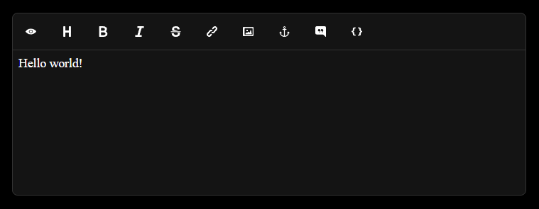

# jmarkd



## Features
- Toolbar with API
- Dark/light themes
- Preview (you need to provide markdown parser)
- Hmm. What else is needed?

## Requirements
- **Modern browser**

## Example
```npm install @oklookat/jmarkd```
```html
<div class="container"></div>
```
```typescript
import jmarkd from '@oklookat/jmarkd'
import '@oklookat/jmarkd/styles'
import { Config } from '@oklookat/jmarkd'

const container = document.getElementsByClassName('container')[0]

const config: Config = {
    container: container,

    // (optional) preview tool config to display parsed markdown
    toolbar: {
        elements: {
            config: {
                preview: {
                    parse: (data) => {
                        return anotherMarkdownParser.parse(data)
                    }
                }
            }
        }
    }
}

const editor = new jmarkd(config)
```

## Creating you own toolbar item
```typescript
import jmarkd from '@oklookat/jmarkd'
import '@oklookat/jmarkd/styles'
import { Config, ToolbarElement } from '@oklookat/jmarkd'

class Say implements ToolbarElement {
    private what: string

    get icon() {
        return "Say"
    }

    setConfig(what: string) {
        this.what = what
    }

    getShortcut() {
        return ['AltLeft', 'KeyE']
    }

    onClick(textarea: HTMLTextAreaElement) {
        textarea.value += this.what
    }
}

const container = document.getElementsByClassName('container')[0]
const config: Config = {
    container: container,
    toolbar: {
        // displayed: ['say'] // if you need leave only your items or change item order
        elements: {
            boot: {
                say: new Say()
            },
            config: {
                say: '🌹'
            }
        }
    }
}

const editor = new jmarkd(config)
```

## Types, configs, toolbars, etc
- **[./src/types.d.ts](./src/types.d.ts)**
- **[./src/factory](./src/factory)**